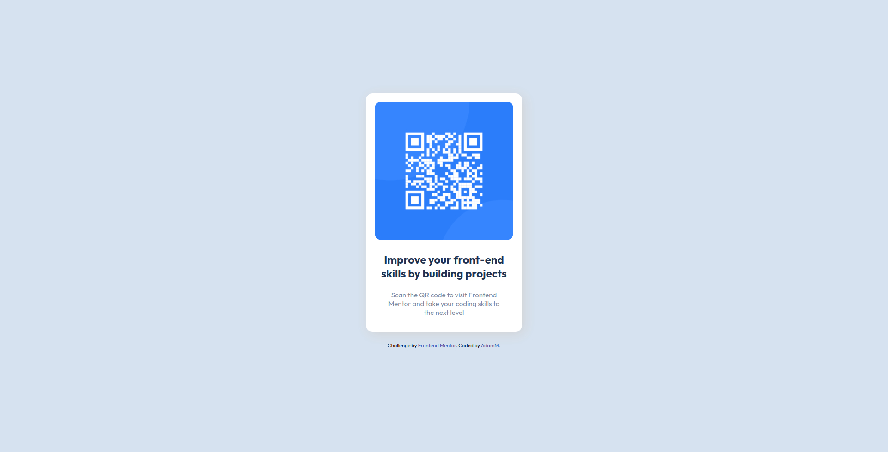

# Frontend Mentor - QR code component solution

This is a solution to the [QR code component challenge on Frontend Mentor](https://www.frontendmentor.io/challenges/qr-code-component-iux_sIO_H). 

## Table of contents

- [The challenge](#the-challenge)
- [Screenshot](#screenshot)
- [Links](#links)
- [Built with](#built-with)
- [Author](#author)

### The challenge

This challenge was to build out this QR code component and get it looking as close to the design as possible. 
This was my first challenge on front-end mentor good warm-up before bigger challenges :)

### Screenshot

### Links 

-Live weebsite -[see live](https://adammzkr.github.io/Front-End-Mentor/QR-code-component/index.html)

### Built with

- CSS custom properties
- Flexbox
 
## Author

- Website - [Adam M](https://github.com/AdamMzkr)
- Frontend Mentor - [@AdmMzkr](https://www.frontendmentor.io/profile/AdamMzkr)
- Email - [adm.mzkr@gmail.com](adm.mzkr@gmail.com)
