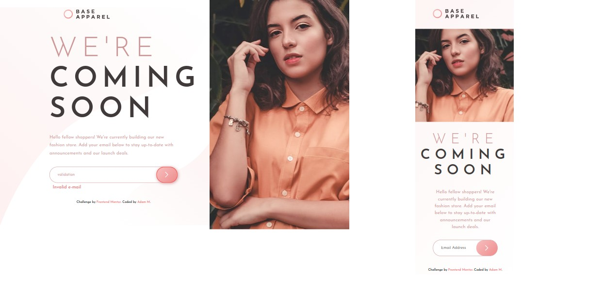

# Frontend Mentor - Base Apparel coming soon page

This is a solution to the [Base Apparel coming soon page](https://www.frontendmentor.io/challenges/base-apparel-coming-soon-page-5d46b47f8db8a7063f9331a0). 

## Table of contents

- [The challenge](#the-challenge)
- [Screenshot](#screenshot)
- [Links](#links)
- [Built with](#built-with)
- [Author](#author)

### The challenge

This challenge was to build out this Stats preview card component and get it looking as close to the design as possible. 

Your users should be able to:
- View the optimal layout for the site depending on their device's screen size
- See hover states for all interactive elements on the page
- Receive an error message when the form is submitted if:
    - The input field is empty
    - The email address is not formatted correctly

### Screenshot

### Links 

-Live website -[see live](https://adammzkr.github.io/Front-End-Mentor/coming-soon-landing-page/index.html)

### Built with
- Semantic HTML
- Responsive Web Design
- CSS custom properties
- Flexbox
- JavaScript DOM manipultion
 
## Author

- Website - [Adam M](https://github.com/AdamMzkr)
- Frontend Mentor - [@AdmMzkr](https://www.frontendmentor.io/profile/AdamMzkr)
- Email - [adm.mzkr@gmail.com](adm.mzkr@gmail.com)
