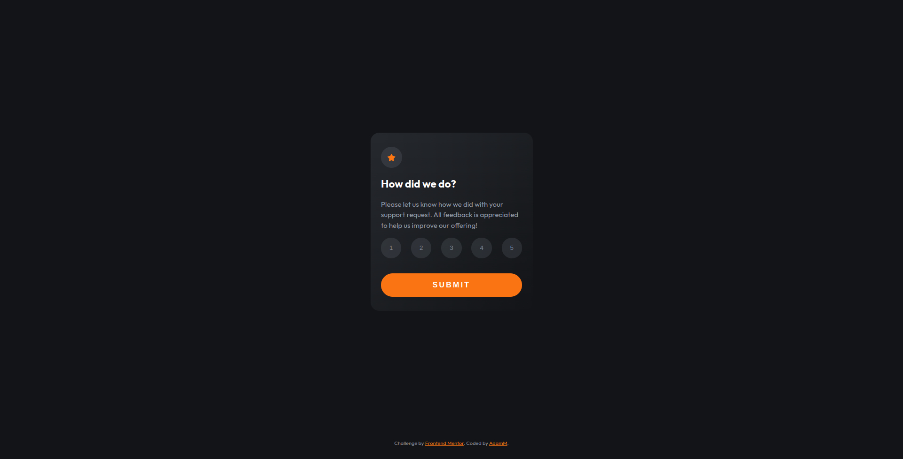

# Frontend Mentor - Interactive rating component

This is a solution to the [Interactive rating component](https://www.frontendmentor.io/challenges/interactive-rating-component-koxpeBUmI). 

## Table of contents

- [The challenge](#the-challenge)
- [Screenshot](#screenshot)
- [Links](#links)
- [Built with](#built-with)
- [Author](#author)

### The challenge

Your users should be able to:

- Select and submit a number rating
- See the "Thank you" card state after submitting a rating
- View the optimal layout for the app depending on their device's screen size
- See hover states for all interactive elements on the page

### Screenshot

### Links 

-Live weebsite -[see live](https://adammzkr.github.io/Front-End-Mentor/interactive-rates-component/index.html)

### Built with
- Semantic HTML
- CSS custom properties
- Flexbox
- JavaScript DOM manipulation
 
## Author

- Website - [Adam M](https://github.com/AdamMzkr)
- Frontend Mentor - [@AdmMzkr](https://www.frontendmentor.io/profile/AdamMzkr)
- Email - [adm.mzkr@gmail.com](adm.mzkr@gmail.com)
